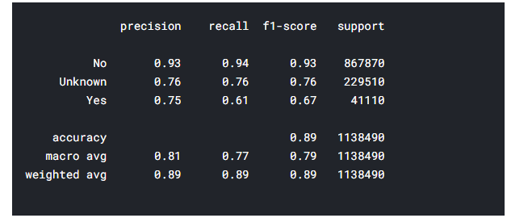
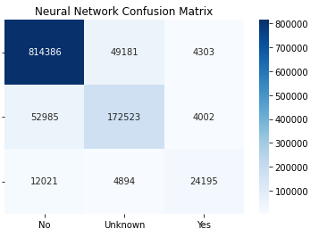
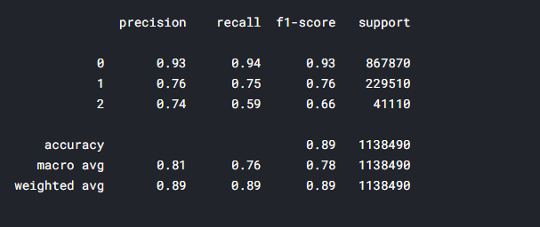
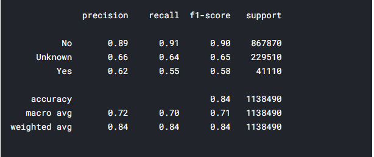

# COVID-19_Case_Surveillance_Public_Use_Data

` `**Content**

- Problem type & the process
- Technical details
  - Dataset description.
  - Exploratory data analysis.
  - Preprocessing: Dealing with the missing data.
  - Model selection and evaluation.

**Problem Type & The Process**

The problem we are trying to solve is classification problem to see whether the COVID-19 patient died or not based on the features in the dataset. The process starts with **exploring the dataset**  which is performing some statistical analysis on the dataset to see the problems in the dataset, and to see the features and its correlation with our target variable. Then comes the **data visualization** which is plotting different charts that gives us the insights about the dataset to know the nature of the dataset. After that, comes the **preprocessing** which is applying some functions that cleans the dataset and makes it ready to undergo the **modeling phase** which includes assessing different models to see which model is the best performing model and fine tune it to acquire the highest accuracy possible. 

**Technical details**

**Dataset description**
**
`	`The COVID-19 case surveillance system database includes individual-level data reported to U.S. states and autonomous reporting entities. COVID-19 case surveillance data are collected by jurisdictions and shared voluntarily with CDC and it contains around 8.4 million records. The feature columns are:

- **1. cdc\_report\_dt :** earlier clinical dates related to illness or specimen collection.
- **2. pos\_spec\_dt**: date at which column name was submitted to the database.
- **3. onset\_dt:** date of the symptoms shown.
- **4. sex:** gender of a person.
- **5. age\_group:** various age groups of a person.
- **6. Race and ethnicity:** social group or clutural tradition of a person.
- **7. hosp\_yn:** status of admission in hospitial.
- **8. icu\_yn:** status of admission in ICU.
- **9. medcond\_yn:** status of pre-existing medical condition.

And the target variable is:

- ` `**death\_yn:** did the patient died as a result of this illness.

**Exploratory Data Analysis: Missing Values**

`	`The dataset contains a lot of null values along with a lot of “missing” value as a string input in the dataset, after transforming these “missing” values to null it turns out that there is a large number of null values in the dataset some may be around 70% of the column.

**Exploratory Data Analysis: Data Visualization**

Some plots were created in order to give us some insights about the dataset and what are the information that we can acquire from such a dataset.

The above plot shows the death rate with respect to the confirmed cases and as noticed the death rate is much higher in the laboratory confirmed cases that the probable cases.

The above plot gives us information about the number of deaths and the difference of the numbers of deaths with respect to the hospital commitment status. And it is noticed that the number of deaths within the patients who didn’t commit to the hospital are higher than the patients who went to the hospital.

The above plot gives us information about the death rates with respect to the age group. And as noticed that the number of deaths gets higher as we move to older people.

The above plot shows whither the covid cases committed to the hospital or not and we can notice that the number of the patient with laboratory confirmed cases committed to the hospital more that the probable cases did but the number of confirmed covid-19 cases who didn’t commit to the hospital are very high.

The above plots show the number of reported covid cases during the months of the year of 2020 and as we can notice as we move towards the end of the year the number of cases increases.

The Above plot shows the number of cases per day through the whole year divided into male and female. And as we can see from this plot that the number of cases is increasing as the days goes by and there is a huge peak of cases from June to July.

**Preprocessing: Dealing with the missing data**

After exploring the data and noticing the huge amounts of missing data, we performed a thresholding technique that drops the row if has null values more than a certain constant threshold.

And then, we applied a machine learning model that predicts the missing values. The model was a random forest classifier due to its performance comparing to the other models that we tried like decision tree and SVM and KNN imputer.

The above plots show the missing values distributed among the other column values and as noticed the model did a good job predicting the missing values of these columns.

**Model selection and evaluation.**

To obtain useful information from this dataset, a classification model was selected to predict the class of the new patient. Various networks were tested like:
  -	Random forest .
  -	AdaBoost Classifier.
  - Neural Network.

**The random forest** scored an accuracy of 89.9%. As shown in the confusion matrix, the classes are distributed logically as the class “No” got the most records and the “Yes” class got the least.

**The neural network** scored an accuracy of 89%. The neural network architecture was composed of 4 fully connected hidden layers with a SoftMax activation on the output to classify the 3 classes. Below are the confusion matrix and the classification report of the neural network model.

**The AdaBoost Classifier** scored an accuracy of 82%. The AdaBoost scored the least accuracy score among the tested models. 

**Comparing the Models**

As shown in the figure, the random forest and the neural network scored almost the same accuracy, then comes the AdaBoost classifier.
The random forest execution time is faster than the neural network.

**Certificate**

        
    

